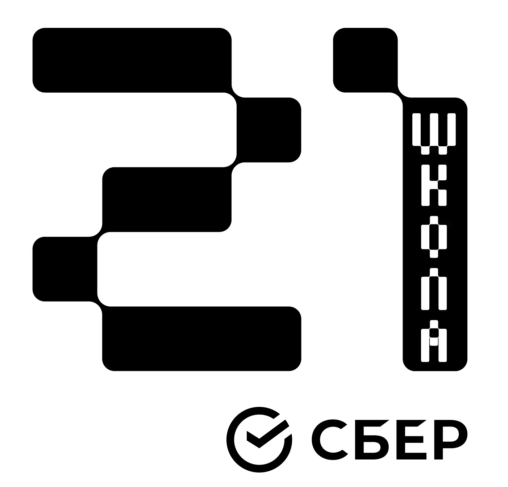

#  Piscine-CPP   

# Contents

* [Program management](#RefProgramManagement)
* [Module 00](#RefModule00)
* [Module 01](#RefModule01)
* [Module 02](#RefModule02)
* [Module 03](#RefModule03)
* [Module 04](#RefModule04)
* [Module 05](#RefModule05)
* [Module 06](#RefModule06)
* [Module 07](#RefModule07)
* [Module 08](#RefModule08)
* [General rules](#RefGeneralRules)

# Program management 

Each application's program is compiled with a `Makefile` on Linux or Mac.
Rules of `Makefile`:
- `make` (build the program)
- `make clean` (delete object files *.o)
- `make fclean` (delete object files *.o and executable program file)
- `make re` (rebuild the program)

## ✔ Module 00 : 
### <strong>Description</strong>

This module contains the basic elements OOP and basic syntax of the C++ language.

- Namespaces, classes, member functions, stdio streams, initialization lists,static, const, and some other basic stuff

## ✔ Module 01 : 
### <strong>Description</strong>

This module focuses on memory allocation, references, element pointers and the use of the SWITCH in C++.

- Memory allocation, pointers to members, references, switch statement

## ✔ Module 02 : 
### <strong>Description</strong>

This module focuses on Ad-hoc polymorphism (Classic or Enforced polymorphism), overloads and orthodox canonical classes in C++.

- Ad-hoc polymorphism, operator overloading and Orthodox Canonical class form

## ✔ Module 03 : 
### <strong>Description</strong>

This module focuses on Inheritance in C++.

- Inheritance

## ✔ Module 04 : 
### <strong>Description</strong>

This module focuses on Subtype polymorphism, abstract classes and interfaces in C++.

- Subtype polymorphism, abstract classes, interfaces

## ✔ Module 05 : 
### <strong>Description</strong>

This module focuses on Try/Catch and Exceptions in C++.

- Repetition and Exceptions

## ✔ Module 06 : 
### <strong>Description</strong>

This module focuses on the different casts in CPP.

- C++ casts

## ✔ Module 07 : 
### <strong>Description</strong>

This module focuses on Templates in CPP.

- C++ templates

## ✔ Module 08 : 
### <strong>Description</strong>

This module focuses on templated containers, iterators and algorithms in CPP.

- Templated containers, iterators, algorithms

# General rules 

- Compile code with `c++` and the flags `-Wall -Wextra -Werror`

- Code should still compile with the flag `-std=c++98`

- Orthodox Canonical Form:

1. Default constructor

2. Copy constructor

3. Copy assignment operator

4. Destructor
